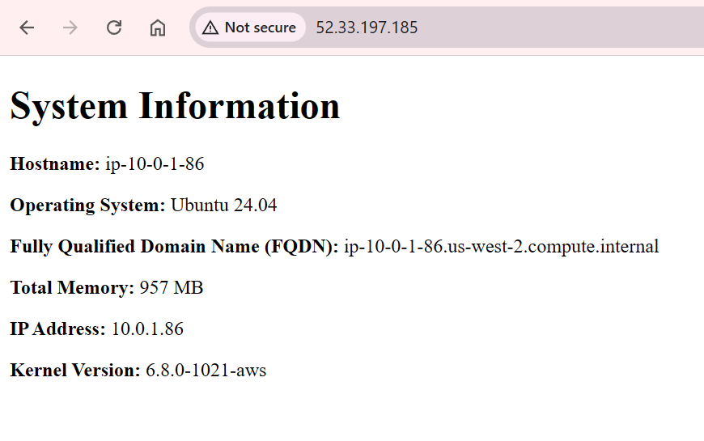
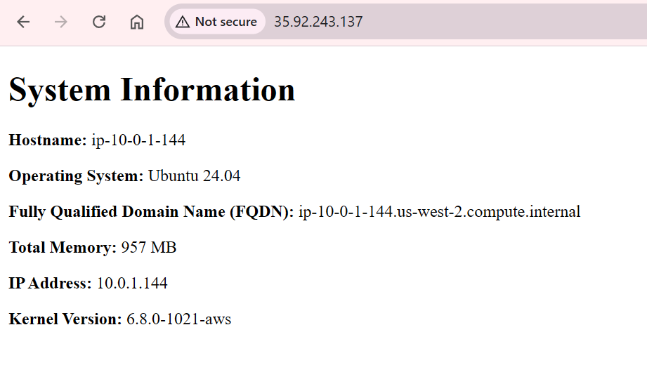

# 4640-w7-lab-start-w25

Starter files for the intro to Ansible lab.
See D2L for lab instructions.


## Required Commands

### Create new keys 
```ssh-keygen -t rsa -b 2048 -f ~/.ssh/aws -N ""```

**Description**

This command generates a new RSA SSH key pair with 2048-bit encryption. The private key is saved as ~/.ssh/aws and the public key as ~/.ssh/aws.pub. The -N "" option sets an empty passphrase for the key.

### Run your playbook
```ansible-playbook -i ansible/inventory/hosts.yml ansible/playbook.yml -v```

**Description**

This command executes an Ansible playbook.
- -i ansible/inventory/hosts.yml: Specifies the inventory file containing the target hosts.
- ansible/playbook.yml: The playbook file to be executed.
- -v: Enables verbose output for more detailed information during execution.

## Screenshot of webpages


